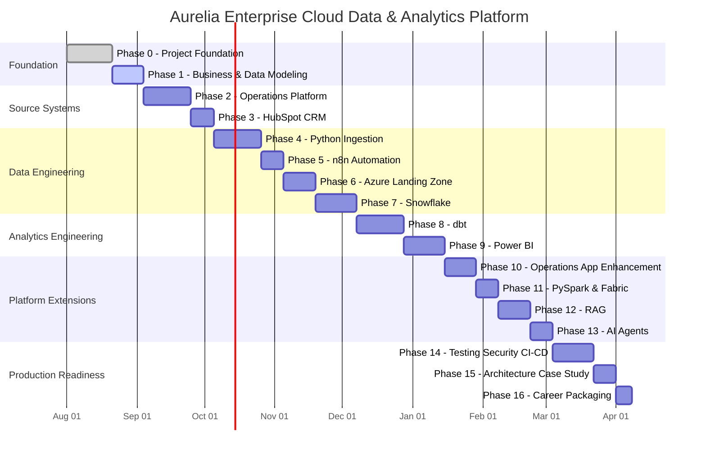

# Aurelia Data Platform — Learning & Delivery Timeline

## Purpose

This timeline estimates the effort required to build the Aurelia Enterprise Cloud Data & Analytics Platform while learning the core concepts properly.

> Estimated total: **180–250 hands-on hours**
>
> Employable core portfolio: approximately **100–140 hours**

## Suggested Pace

| Weekly Effort | Estimated Duration |
|---|---:|
| 5 hours/week | 9–12 months |
| 10 hours/week | 4–6 months |
| 15 hours/week | 3–4 months |
| 20 hours/week | 2–3 months |

## Gantt Chart



The dates above are illustrative. Progress should be driven primarily by completed deliverables rather than calendar dates.

## Phase Effort Estimate

| Phase | Topic | Estimated Hours | Primary Outcome |
|---|---|---:|---|
| 0 | Foundation & PM/BA | 10–15 | Charter, requirements, architecture, Git |
| 1 | Business & Data Modeling | 12–18 | Domain model, ERD, grains, keys, logical model |
| 2 | PostgreSQL Operations Source | 15–22 | Operational relational database |
| 3 | HubSpot CRM | 6–10 | Real CRM source and API familiarity |
| 4 | Python Data Engineering | 18–25 | Reliable API/file ingestion framework |
| 5 | n8n Automation | 8–12 | Workflow and event automation |
| 6 | Azure Data Landing | 10–15 | Cloud landing-zone implementation |
| 7 | Snowflake | 15–22 | RAW data warehouse layer |
| 8 | dbt Analytics Engineering | 20–28 | Tested staging, intermediate, marts |
| 9 | Power BI | 15–22 | Business dashboards and semantic model |
| 10 | Operations App | 12–18 | Supporting React/.NET application |
| 11 | PySpark / Fabric | 8–12 | Secondary big-data/cloud exposure |
| 12 | RAG | 12–18 | Document retrieval assistant |
| 13 | AI Agents | 8–12 | Read-only structured AI workflows |
| 14 | Testing / Security / CI-CD | 15–22 | Production-readiness practices |
| 15 | Architecture Case Study | 8–12 | Portfolio-quality system explanation |
| 16 | Career Packaging | 6–10 | GitHub, resume, LinkedIn, interview stories |

## Major Portfolio Milestones

### Milestone A — Enterprise Modeled
Completed after Phase 1.

You can explain:
- business domains
- relational modeling
- grain
- keys
- normalization
- source-system ownership

### Milestone B — Operational Platform Alive
Completed after Phase 3.

You have:
- PostgreSQL source
- synthetic ERP/finance source
- HubSpot CRM source
- representative operational transactions

### Milestone C — Cloud Data Pipeline
Completed after Phase 7.

```text
Sources
  ↓
Python / n8n
  ↓
Azure
  ↓
Snowflake RAW
```

At this point the portfolio strongly demonstrates **Cloud Data Engineering**.

### Milestone D — Analytics Platform
Completed after Phase 9.

```text
Snowflake
  ↓
dbt
  ↓
Dimensional Models
  ↓
Power BI
```

This is the primary employable **Data Engineer / Analytics Engineer** milestone.

### Milestone E — Enterprise Platform Complete
Completed after Phase 14.

Adds:
- supporting application
- automation
- security
- testing
- CI/CD
- monitoring
- production architecture

### Milestone F — Differentiation & Career Packaging
Completed after Phase 16.

Adds:
- PySpark / Fabric
- RAG
- AI agents
- architecture case study
- polished GitHub
- resume/interview positioning

## Progress Tracking

Use these statuses:

- `[ ]` Not Started
- `[~]` In Progress
- `[x]` Completed

Current status:

```text
[x] Phase 0 — Foundation
[~] Phase 1 — Business & Data Modeling
[ ] Phase 2 — Operations Platform
[ ] Phase 3 — HubSpot CRM
[ ] Phase 4 — Python Data Engineering
[ ] Phase 5 — n8n Automation
[ ] Phase 6 — Azure
[ ] Phase 7 — Snowflake
[ ] Phase 8 — dbt
[ ] Phase 9 — Power BI
[ ] Phase 10 — Operations App
[ ] Phase 11 — PySpark / Fabric
[ ] Phase 12 — RAG
[ ] Phase 13 — AI Agents
[ ] Phase 14 — Production Readiness
[ ] Phase 15 — Architecture Case Study
[ ] Phase 16 — Career Packaging
```
